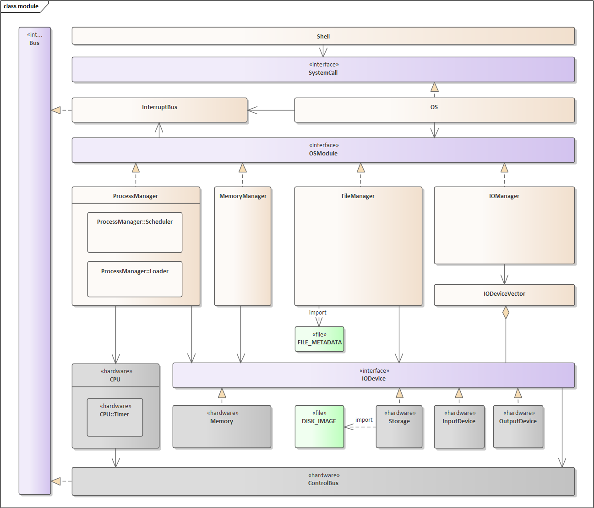

<h1 align="center">minivm</h1>

<i>Summary : This project is about implementation of hardware and operating system. The goal is to implement a simple virtual machine in Java.</i>

<h1>Contents</h1>
<ol type='I'>
  <li>Summary</li>
  <li>Instruction set</li>
  <li>General hardware interrupt</li>
  <li>Module structure</li>
</ol>
<h1>Summary</h1>

**minivm** is a project for System Programming 2 at Myongji University in the 2nd semester of 2023. 

This project is divided into three major layers: hardware layer, kernel layer and user layer. 

**Hardware layer** is composed of CPU and IODevices along with control bus for their communication. 

**Kernel layer** is composed of managers and logical units(Process, Page...) for managing hardware. It also incorporates an interrupt bus to facilitate communication between OS modules. 

**User layer** is designed as a Shell that executes defined functions using system call implemented by the OS. 

<h1>Instruction set</h1>

<h1>General hardware interrupt</h1>
Following interrupts are shared by all hardware. 

|  ID  | Mnemonic | Name                                              | Description                 |
|:----:|:--------:|:--------------------------------------------------|:----------------------------|
| 0x00 |   SHC    | **S**ignal **H**ealth **C**heck                   | Check status of hardware.   |
| 0x01 |   AHC    | **A**cknowledgement **H**ealth **C**heck          | Positive response for SHC   |
| 0x02 |   NHC    | **N**egative acknowledgement **H**ealth **C**heck | Negative response for SHC   |
| 0x03 |   RPR    | **R**equest **P**rocessor **R**ead                | Read request from processor |
| 0x04 |   APR    | **A**cknowledgement **P**rocessor **R**ead        | Positive response for RPR   |
| 0x40 |   SEG    | **SEG**mentation fault                            | Bad memory access           |

<h1>Module structure</h1>

