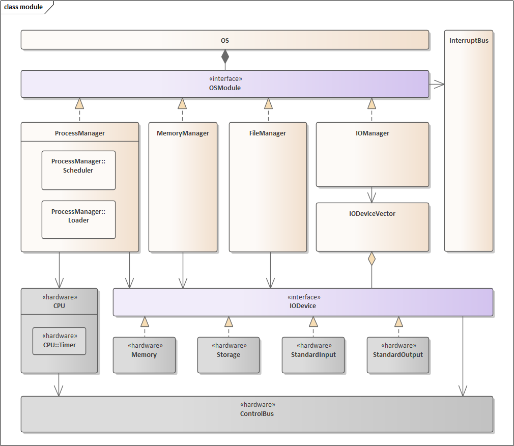

<h1 align="center">minivm</h1>

<i>Summary : This project is about implementation of hardware and operating system. The goal is to implement a simple virtual machine in Java.</i>

<h1>Contents</h1>
<ol type='I'>
  <li>Summary</li>
  <li>Instruction set</li>
  <li>Hardware interrupt</li>
  <li>Software interrupt</li>
  <li>Module structure</li>
</ol>
<h1>Summary</h1>

**minivm** is a project for System Programming 2 at Myongji University in the 2nd semester of 2023. 

This project is divided into three major layers: hardware layer, kernel layer and user layer. 

**Hardware layer** is composed of CPU and IODevices along with control bus for their communication. 

**Kernel layer** is composed of managers and logical units(Process, Page...) for managing hardware. It also incorporates an interrupt bus to facilitate communication between OS modules. 

**User layer** is designed as a Shell that executes defined functions using system call implemented by the OS. 

<h1>Instruction set</h1>

<h1>Hardware interrupt</h1>
Following interrupts are shared by all hardware. 
0x00 ~ 0x39 are signal, request, acknowledgement. 
0x40 ~ 0xFF are hardware exception. 

|  ID  | Mnemonic | Name                                  | Description                  |
|:----:|:--------:|:--------------------------------------|:-----------------------------|
| 0x00 |   SHC    | Signal health check                   | Check status of hardware     |
| 0x01 |   AHC    | Acknowledgement health check          | Positive response for SHC    |
| 0x02 |   NHC    | Negative acknowledgement health check | Negative response for SHC    |
| 0x03 |   RPR    | Request processor read                | Read request from processor  |
| 0x04 |   APR    | Acknowledgement processor read        | Positive response for RPR    |
| 0x05 |   RPW    | Request processor write               | Write request from processor |
| 0x06 |   APW    | Acknowledgement processor write       | Positive response for RPW    |
| 0x07 |   HLT    | halt                                  | terminated running process   |
| 0x40 |   SEG    | Segmentation fault                    | Bad memory access            |

<h1>Software interrupt</h1>
Following interrupts are shared by all OS modules. 
0x00 ~ 0x31 are process manager interrupts. 
0x32 ~ 0x63 are memory manager interrupts. 
0x64 ~ 0x95 are file manager interrupts. 
0x96 ~ 0xFF are io manager interrupts. 

|  ID  | Mnemonic | Name           | Description                            |
|:----:|:--------:|:---------------|:---------------------------------------|
| 0x00 |   SCX    | Switch context | Request switching context of CPU       |

<h1>Module structure</h1>

